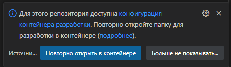

## NestJS Project Template

Этот шаблон проекта основан на следующих технологиях:

- [NodeJS 22+](https://nodejs.org/)
- [NestJS 10+](https://nestjs.com/)
- [Fastify](https://fastify.dev/) ([NestJS Fastify Adapter](https://github.com/nestjs/nest/tree/master/packages/platform-fastify))
- [Prisma](https://www.prisma.io/)
- [Nestia](https://nestia.io/)
- [Typia](https://typia.io/)
- [h2load](https://nghttp2.org/documentation/h2load-howto.html)
- [Visual Studio Code Dev Containers](https://code.visualstudio.com/docs/devcontainers/containers)


Доступны следующие клиенты из docker-compose:

- [Grafana](https://grafana.com) c предустановленными дашбордами и [Loki](https://github.com/grafana/loki?tab=readme-ov-file) - http://localhost:3000
- [Prometheus](https://prometheus.io/) - http://localhost:9090

Swagger - http://localhost:7000/api

### Начало разработки
<!-- 
Предпочтительным редактором является Visual Studio Code, позволяющий запускать проект внутри [Dev Containers](https://code.visualstudio.com/docs/devcontainers/containers) с одинаковым окружением вне зависимости от локальной машины. В .devcontainer настроена виртуальная машина Linux с поддержкой Docker in Docker

Для запуска в Windows потребуется [Docker Desktop](https://www.docker.com/products/docker-desktop/), использующий [WSL](https://learn.microsoft.com/ru-ru/windows/wsl/install) в качестве бэкенда. Открывать проект следует из файловой системы WSL

После открытия проекта, редактор предложит открыть его в контейнере. Все необходимые модули будут установлены автоматически



#### Без Visual Studio Code -->

##### Запуск контейнеров в фоновом режиме 

```bash
docker-compose up -d
```

##### Установка зависимостей

```bash
npm install
```

##### Применение миграций

```bash
npm run prisma:dev
```

##### Старт

```bash
npm run start:dev
```

##### Установка h2load (для нагрузочного тестирования)

```bash
apt install -y nghttp2
```

### Предустановленные фичи

#### Генерация SDK

Проект поддерживает автоматическую генерацию TypeScript SDK на основе контроллеров с использованием [Nestia SDK](https://nestia.io/docs/sdk/).

SDK генерируется из всех контроллеров в директории `src/**/*.controller.ts` (исключая webhook контроллеры) и размещается в директории `nestia-api`. Готовая сборка SDK находится в `sdk-package/api`.

**Основные команды для работы с SDK:**

- Сборка SDK:
```bash
npm run sdk:build
```

- Полная пересборка SDK (с очисткой структур):
```bash
npm run sdk:build:hard
```

- Публикация SDK в npm (с автоматическим увеличением минорной версии):
```bash
npm run sdk:push
```

- Публикация SDK в npm (с автоматическим увеличением мажорной версии):
```bash
npm run sdk:push:major
```

Конфигурация генерации SDK находится в файле `nestia.config.ts`. SDK автоматически включает типизацию и валидацию на основе декораторов из `@nestia/core`.

**Пример использования сгенерированного SDK:**

1. Установка пакета:
```bash
npm install @baron-zemo/backend-api2
```

2. Использование в коде:
```typescript
import { IConnection } from '@nestia/fetcher'
import api from '@baron-zemo/backend-api2'

// Создание соединения
const connection: IConnection = {
  host: 'http://localhost:7000',
  headers: {
    // Опционально: добавление токена авторизации
    // Authorization: 'Bearer your-token-here'
  }
}

// GET запрос с query параметрами
const helloResponse = await api.functional.getHello(connection, {
  text: 'Hello World',
  num: 42
})
console.log(helloResponse.text) // "Hello World 42"

// POST запрос с телом
const powerResponse = await api.functional.power(connection, {
  number: 2,
  degree: 3
})
console.log(powerResponse.result) // 8

// Использование других эндпоинтов
const post = await api.functional.post.createPost(connection, {
  title: 'My Post',
  body: 'Post content',
  email: 'user@example.com'
})
```

SDK обеспечивает полную типизацию всех запросов и ответов, автоматическую валидацию данных и поддержку авторизации через заголовки.

Подробнее про использование: [Nestia SDK](https://nestia.io/docs/sdk/)


#### Валидация входных данных

Для валидации входных данных в контроллерах используются декораторы, предоставленные @nestia/core вместо стандартных. Внутри этот модуль использует typia, поэтому поддерживается вся её валидация. Полный список тегов для валидации доступен [здесь](https://typia.io/docs/validators/tags/).

#### Генерация OpenAPI спецификации

Преднастроен генератор OpenAPI спецификации на основе @nestia/sdk, совместимый с валидацией @nestia/core.

- Swagger UI доступен по URL: `/api`
- OpenAPI документ доступен по URL `/api-json`
- Поддерживается генерация документа в виде файла с помощью команды:

```bash
npm run build:swagger
```

Подробнее про использование: [Nestia SDK Swagger](https://nestia.io/docs/sdk/swagger/)

Базовые настройки OpenAPI спеки берутся из файла: `src/openapi-base.const.ts`

Название проекта берётся из package.json.

#### Поддержка работы в режиме кластера

Изменена точка запуска приложения для опциональной поддержки работы в режиме кластера ([node:cluster](https://nodejs.org/api/cluster.html)).

`src/main.ts` перестал запускать веб-сервер, вместо этого он экспортирует функцию `bootstrap`.

Добавлены 2 файла для запуска:

- `src/bin/single` для стандартного запуска в однопоточном режиме
- `src/bin/cluster` для запуска в многопоточном режиме (кластера)

#### Логи и метрики

Настроен сбор метрик в [Prometheus](https://prometheus.io/) с возможностью использовать кастомные метрики через MetricsService

**Логирование на основе Pino**

Проект использует [Pino](https://getpino.io/) как высокопроизводительный логер вместо стандартного `ConsoleLogger` из NestJS. При этом полностью сохраняется совместимость с API NestJS и контекст логирования.

**Реализация:**

1. **Кастомный PinoLogger** (`src/common/services/pino-logger.service.ts`) расширяет `ConsoleLogger` из NestJS и делегирует все вызовы методов (`log`, `error`, `warn`, `debug`, `verbose`) в Pino логер Fastify.

2. **Сохранение контекста:** Контекст автоматически добавляется в каждое сообщение в формате `[Context] message`. Это позволяет легко идентифицировать источник лога в приложении.

3. **Интеграция:** В `bootstrap.ts` PinoLogger передается в `NestFactory.create()` с опцией `bufferLogs: true`, что позволяет буферизовать логи до полной инициализации приложения.

**Пример использования:**

```typescript
// В любом сервисе или контроллере
export class MyService {
  private readonly logger = new Logger(MyService.name) // Контекст: "MyService"
  
  someMethod() {
    this.logger.log('Processing data') // Выведет: [MyService] Processing data
    this.logger.error('Error occurred', error) // Выведет: [MyService] Error occurred
  }
}
```

**Конфигурация логирования:**

Настройки логирования находятся в `src/configs/logger.config.ts` и управляются через переменные окружения:

- `LOG_LEVEL` - уровень логирования (`silent`, `error`, `warn`, `info`, `debug`)
- `ENABLE_CONSOLE_LOGGING` - включение/выключение вывода в консоль (используется `pino-pretty` для форматирования)
- `LOKI_URL` - URL для отправки логов в Loki (опционально)
- `LOKI_USERNAME` / `LOKI_PASSWORD` - учетные данные для Loki (опционально)

**Особенности:**

- Логи автоматически отправляются в [Loki](https://github.com/grafana/loki?tab=readme-ov-file) при наличии `LOKI_URL`
- В консоли логи форматируются через `pino-pretty` для удобного чтения
- HTTP запросы автоматически логируются с полной информацией (body, query, params, headers) при ошибках или в режиме разработки
- Все логи структурированы и содержат метаданные (время, уровень, контекст)

#### Проверки качества кода перед коммитом

Проект использует [Husky](https://typicode.github.io/husky/) для автоматического запуска проверок перед каждым коммитом. Это гарантирует, что в репозиторий попадает только качественный код.

**Автоматические проверки перед коммитом:**

При выполнении `git commit` автоматически запускаются следующие проверки:

1. **Форматирование кода** (`npm run format`)
   - Автоматическое форматирование всех файлов с помощью [Prettier](https://prettier.io/)
   - Обрабатываются файлы: `src/**/*.ts`, `nestia-api/**/*.ts`, `sdk-package/api/lib/**/*.ts`

2. **Линтинг кода** (`npm run lint`)
   - Проверка кода с помощью [ESLint](https://eslint.org/)
   - Автоматическое исправление найденных проблем (где возможно)
   - Проверка правильности импортов и их сортировка
   - Проверка на неиспользуемые переменные и другие проблемы

3. **Проверка циклических зависимостей** (`npm run lint:deps`)
   - Анализ зависимостей с помощью [dependency-cruiser](https://github.com/sverweij/dependency-cruiser)
   - Обнаружение циклических импортов между модулями
   - Проверка циклических зависимостей через barrel-файлы (index.ts)

**Проверка циклических импортов:**

Проект использует два уровня проверки циклических зависимостей:

1. **ESLint правило `import/no-cycle`**
   - Проверяет циклические импорты на уровне отдельных файлов
   - Ошибка при обнаружении циклической зависимости
   - Настроено в `eslint.config.mjs`

2. **Dependency Cruiser**
   - Глубокий анализ графа зависимостей всего проекта
   - Обнаружение скрытых циклических зависимостей через barrel-файлы
   - Конфигурация находится в `dependency-cruiser.js`
   - Правила:
     - `no-circular` - строгая проверка (error) на любые циклические зависимости
     - `no-circular-via-barrel` - предупреждение (warn) о циклических зависимостях через index.ts

**Ручной запуск проверок:**

Вы можете запустить проверки вручную в любой момент:

```bash
# Форматирование кода
npm run format

# Линтинг с автоисправлением
npm run lint

# Только проверка циклических зависимостей
npm run lint:deps
```

**Важно:**

- Если проверки не проходят, коммит будет отклонен
- Все проверки должны пройти успешно перед коммитом
- Это помогает поддерживать качество кода и избегать проблем с инициализацией модулей в NestJS

<br>

# 📋 TODO List

## 🚀 Завершено
- [x] Добавить pino как движок для логирования + опциональное логирование в Loki
- [x] Добавить мониторинг с помощью Prometheus:
   - стандартных метрик nodejs
   - метрик fastify ([fastify-metrics](https://github.com/SkeLLLa/fastify-metrics))
   - кастомных метрик в стиле NestJS
- [x] Добавить health checks
- [x] Добавить Prisma
- [x] Привести ошибки к единому виду и добавить их в генерацию OpenAPI документа


<!-- ---

### 📆 Приоритеты
- **🔥 Высокий приоритет**
  - [ ] Реализовать уведомления в реальном времени
  - [ ] Оптимизировать запросы к базе данных
- **✨ Средний приоритет**
  - [ ] Обновить дизайн сайта
  - [ ] Добавить документацию API
- **💡 Низкий приоритет**
  - [ ] Улучшить тестовое покрытие -->

---

### 🛠️ Примечания
- Если вы хотите предложить изменения или улучшения, создайте новый issue.

---

🎯 **Давайте сделаем это вместе!**
